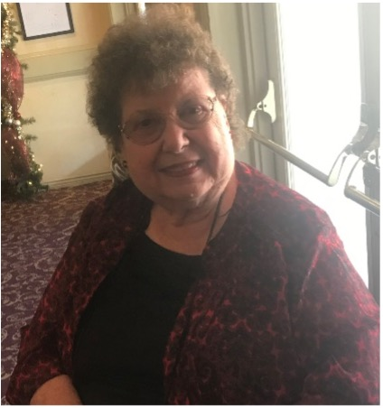

Navigating the post-acute care journey is a lot easier when you have a supportive team at your side to ensure the most meaningful and comfortable experience possible. Volunteers play an important role in caring for hospice patients by providing companionship and support. Hospice volunteers spend their time talking with and listening to patients, reading aloud, offering companionship, helping them do things they enjoy like crafts or playing games, and much more. They can offer relief to family caregivers by providing them with reassurance that their loved one will have someone there for them. 

Charter Healthcare is fortunate to have many wonderful volunteers assisting patients across the states it serves. This National Volunteer Month, we highlight just a few of our exemplary volunteers who go above and beyond to enhance the lives of patients and provide a sense of relief for loved ones.

If you are interested in becoming a hospice volunteer, contact a [Charter Healthcare location near you](https://charterhcg.com/locations).

##### Helen Davis, Moreno Valley, CA

Helen has been a hospice volunteer for 17 years. Drawing on her many years of service, Helen now organizes the production of monthly patient gifts. She has come to know the talents of the other volunteers and utilizes everyone’s strengths to plan their monthly projects. She also makes lap robes to distribute to Charter hospice patients during the holidays. 

Helen loves what she does and encourages others to get involved in volunteering. “We invite others to our meeting so they can see what we do and how much fun we have doing things for others,” she says. “Even when someone says they are not crafty, we find just the right thing for them to do that makes them feel good about themselves and helps others.”

##### Anthony Fisher, Moreno Valley, CA

Anthony began volunteering at Charter Hospice three years ago to pursue his passion for medicine and build skills that would complement his desire to become a neurosurgeon. Before the COVID-19 pandemic, he would visit with patients and talk with them about their lives and accomplishments. When isolation measures became necessary he transitioned to virtual visits to maintain contact with patients and help to combat the loneliness that resulted from prolonged separations from family and friends. “We want patients to know their lives are valuable and we care about them,” Anthony explains. “Volunteering is important because it provides patients with companionship and the necessary social interactions to continue to find those happy moments in life.”

##### Carolann Stephens, Moreno Valley, CA

Carolann was inspired to become a hospice volunteer after her husband passed and she moved to southern California to be closer to her family. She has volunteered with Charter for 13 years, working in the office, visiting patients and family members, assisting with training of high school volunteers, working on monthly craft gifts and more. 

“Volunteering is very satisfying,” says Carolann. “You need to be a good listener and allow a patient to reminisce. They want someone to share their stories with and someone to share their laughter and their tears. The things a volunteer learns in the time they spend with a patient are a treasure.”

##### Kashmaila, Aavisara, Aimal and Noor Ali, Rancho Cucamonga, CA
The Ali sisters have accrued nearly 2,000 volunteer hours since they began volunteering with Charter in 2018. Each has unique strengths they utilize to provide patients with a secure environment and comfortable experience. Kashmaila’s powerful communication skills make her an effective volunteer team leader and mentor. Aavaisara’s attention to detail is particularly valuable when she engages with patients in person and over Zoom. Aimal’s compassionate demeanor and exceptional listening skills have made her a trusted confidante among many patients. Noor’s kindness and receptive demeanor sets patients at ease and makes them feel comfortable. Their commitment to our patients makes a significant difference in their overall wellbeing and quality of life.

##### Zaira Chanax, San Gabriel, CA
Zaira has completed more than 175 volunteer hours serving as team leader for the Charter Hospice program in the San Gabriel Valley. She regularly goes beyond the call of duty to support her team and ensure they have the information necessary to help as many patients as possible. During the pandemic, Zaira has remained committed to the Charter Hospice volunteer program by displaying strong leadership among her fellow volunteers and completing many virtual patient visits.

##### Luna Gonzalez, Moreno Valley, CA
Luna has served as president of the Hospice Huskies, our volunteer group in Moreno Valley since 2019. She has logged more than 260 volunteer hours and has led training and orientation programs for many other volunteers. A talented artist, Luna created a mural for Corona Post-Acute Care that hangs in the facility for all patients to enjoy.

##### Clemens Kang, Eastvale, CA
As president of the Hospice Mustangs, our volunteer group in Eastvale, Clemens consistently demonstrates tremendous leadership and compassion. He has volunteered more than 124 hours over the past year and is dedicated to honoring patients through active listening, companionship and friendship. 

##### Karina Lanca, Palm Springs, CA
Karina is a student at Palm Springs High School and serves as secretary of Charter Healthcare’s hospice volunteer program in Palm Desert. She is extremely dedicated to the program and has a passion to serve others. During her time as a volunteer Karina has never missed an event and is always available to help patients and team members. 

##### Ashley Ponce, Bloomington, CA
Ashley has volunteered for more than 640 hours, attending in-service trainings, making patient visits and participating in craft projects. When the COVID-19 pandemic struck, Ashley adapted her strategies for connecting with patients and spent time writing notes and visiting with patients via Zoom. 

##### Madison Waite, Apple Valley, CA
Despite the challenge of volunteering during a pandemic, Madison logged more than 125 hours volunteering for Charter Healthcare in the High Desert during the 2020-2021 school year. She pushed herself to accomplish meaningful patient tasks and used her artistic abilities to create birthday cards, videos, holiday crafts and more. Colleagues at the High Desert location love to work with Madison because they know she is dedicated to patients’ well-being and will do a great job no matter what.
