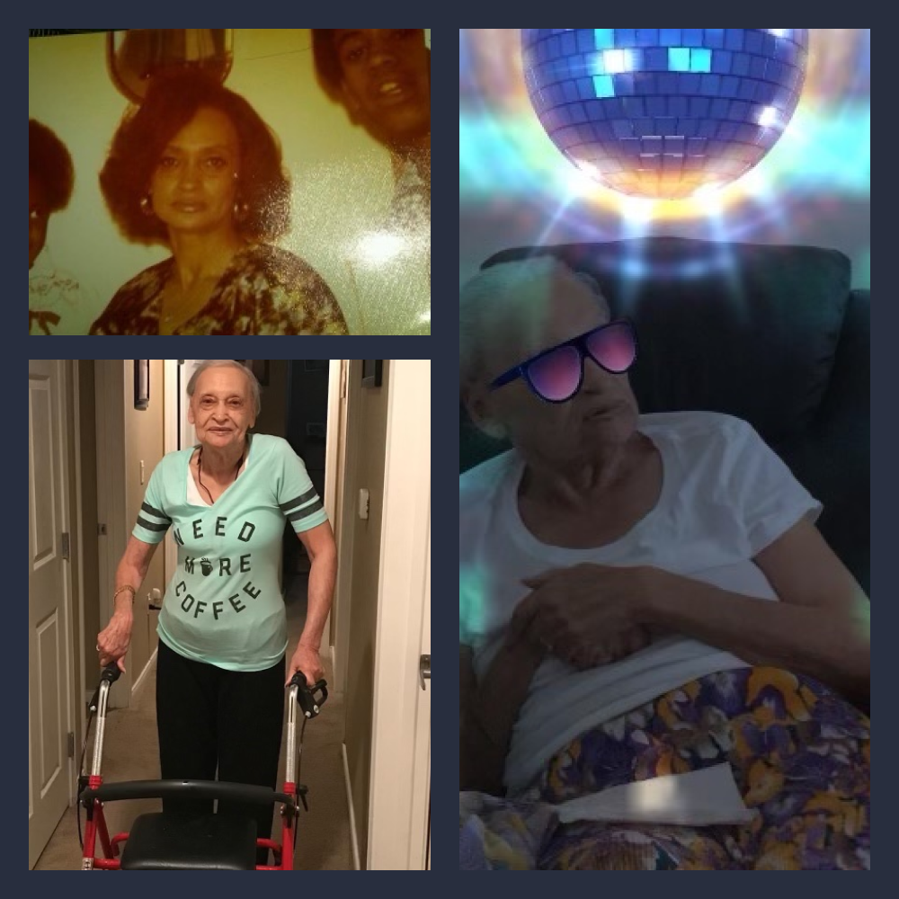

Charter Healthcare is humbled and honored to serve our patients’ needs across the six states where we operate.  Not only do we take the comfort and care of our patients very seriously, but we also strive to ensure we are alleviating any unnecessary stress or burden for their loved ones during the last stages of life. 
 
Below is just one of many stories that has touched us and reminds us why we strive to earn our patients and their families’ trust during an incredibly difficult and daunting time to navigate.

###### Sara Jackson
Sara Jackson began her care with Charter Healthcare of Las Vegas in March 2020 at 89-years-of-age for a cerebral infarction. She resided in a group home and required around-the-clock care. Sadly, Ms. Jackson passed away in January 2021 with family by her side.

Heather Polk, one of our Directors of Patient Clinical Services, reached out to Ms. Jackson’s granddaughter, Latisha, after learning the news of her passing to see how she and the rest of the family were coping and to ensure her level of care with Charter was what the family expected of us.
 
Latisha was kind enough to share her experience with us.

“At every turn, the Charter team was transparent and always kept me and the family informed as to her plan of care and what the next steps would/could be. Nicole, my grandmother's CNA, and Katie, her nurse, would help my Grandma FaceTime me so I could see her and talk to her during their visits. The staff was always encouraging us to be involved, especially since we could not be there daily.”

Unfortunately, due to COVID-19 restrictions Ms. Jackson’s family was not allowed in to visit very often.
 
Latisha also stated that the Charter care team “always gave me the facts; they did not try to fool me or tell me what I wanted to hear.” Prior to this experience, Latisha said that she and the rest of the family were not knowledgeable about hospice and that the team “educated us all through the process.” She also stated, “I cannot say enough about what a great team you have!”

Latisha was very impressed with all Charter teammates she met, but especially thankful to Katie Fetter, RN CM, Nicole Davis, CNA, Nate Gilford, MSW and Heather Polk, DPCS.  Lastly, she stated, “I felt a part of the team, always knew the next step and that my Grandmother was being well taken care of.”

We want to thank Latisha and her family for sharing this story with us and hope they find comfort in knowing Ms. Jackson was well-taken care of in her last stages of life.

